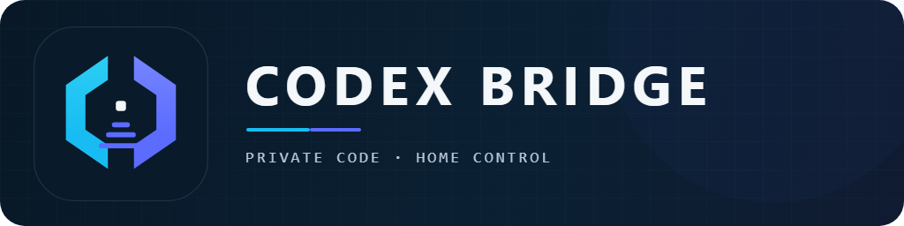

<div align="center">



# Home Assistant Codex Bridge

Keep browser traffic on Home Assistant while a private HAOS App connects to
Codex/OpenAI from your home network.

[](https://my.home-assistant.io/redirect/hacs_repository/?owner=Herbertmt978&repository=ha-codex-bridge&category=integration)
[](https://github.com/Herbertmt978/HA_Codex_Bridge/releases/latest)
[](https://github.com/Herbertmt978/HA_Codex_Bridge/actions/workflows/ci.yml)
[](https://github.com/Herbertmt978/HA_Codex_Bridge/actions/workflows/release.yml)
[](codex_bridge_app/README.md)
[](LICENSE)

[Installation](docs/installation.md) | [Capabilities](#automations-and-codex-capabilities) | [Updates](#updates-and-recovery) | [Remote access](docs/remote-access.md) | [Backup and recovery](docs/backup-restore.md) | [Security](SECURITY.md) | [Support](SUPPORT.md)

</div>

## What it is

Codex Bridge keeps Home Assistant as the user-facing control plane. An
administrator works in the Home Assistant panel; the private Bridge coordinates
Codex and a deliberately granted workspace.

```text
Browser -> Home Assistant -> Codex Bridge Integration -> private App or external Bridge -> Codex / OpenAI
```

The browser does not connect directly to the Bridge, App, or Codex. Publish
Home Assistant through its normal LAN or HTTPS remote-access route instead.
Nabu Casa, Cloudflare, or another reverse proxy can provide that route; the
App and Bridge remain private to Home Assistant.

## Two components, two installation paths

- **HACS Integration:** the `codex_bridge` custom integration supplies the
  administrator panel and is installed through HACS. The HACS link above opens
  a custom-repository flow; it is not a statement that this project is listed,
  reviewed, endorsed, or supported by HACS or Home Assistant.
- **Supervisor App:** the private runtime intended to run the Bridge and Codex
  alongside Home Assistant. Add this repository to the Home Assistant App
  store to install its published immutable image.

<details>
<summary><b>Current release and validation details</b></summary>

- **Historical fully target-HA-accepted release:** App, Integration, and panel `0.7.5`, Bridge
  `0.6.3`, and Codex `0.144.5` were installed and running on target Home
  Assistant `192.168.50.20` on 2026-07-16. ChatGPT Pro remained connected. A
  fresh direct chat defaulted to `gpt-5.6-sol` with `low` thinking; the catalogue
  exposed Sol, Terra, and Luna with Low, Medium, High, XHigh, Max, and Ultra
  where advertised. The compact composer rendered five-hour `Off` and Week
  `60%`.
- **Native live search:** the natural prompt `what is the weather in Malta like
  today` recorded `Searching the web` run activity and returned current live
  conditions. This is provider-side search, not shell-command networking.
- **Latest signed and target-smoked release:** App, Integration, and panel
  `0.8.3`, Bridge `0.7.2`, and Codex `0.144.5` are published from exact main
  commit `913c08d3393574f799baf0b47e78d31422c12fe1`. Main CI
  [run 29544350904](https://github.com/Herbertmt978/HA_Codex_Bridge/actions/runs/29544350904)
  and the signed App publication
  [run 29544351022](https://github.com/Herbertmt978/HA_Codex_Bridge/actions/runs/29544351022)
  passed. The immutable App digest is
  `sha256:bd8c9b1e275e5f832a64d81d8aabb163c8f8d4e755ec317a6eeac530788741fa`;
  [provenance attestation 35745773](https://github.com/Herbertmt978/HA_Codex_Bridge/attestations/35745773)
  accompanies the
  [0.8.3 release](https://github.com/Herbertmt978/HA_Codex_Bridge/releases/tag/0.8.3).
- **Target-HA acceptance (bounded):** On `192.168.50.20`, App and Integration
  `0.8.3` reported Bridge `0.7.2` and Codex `0.144.5`; ChatGPT Pro, projects,
  and chat history were retained. The former `0.8.0 PDF acceptance` thread
  recovered from a false **Working / Preparing a response / Stop / steer**
  state to a truthful ready/Run completed state. A fresh GPT-5.6-Sol prompt
  completed, Sol/Terra/Luna and advertised Max/Ultra reasoning levels were
  visible, five-hour usage rendered `Off`, and the Malta prompt exposed
  `Searching the web` and `Using web search` before returning live conditions.
  No false global **Connection issue** remained after the successful run.
- **0.8.4 candidate:** App/Integration/panel `0.8.4` with Bridge `0.7.3`
  passes the complete local/frontend/Linux/container matrix and independent
  review. It repairs selected-workspace PDF reads, adds revocation-safe private
  image artifacts, and adds strict remote/recovery evidence tooling. It is not
  represented as signed, installed, or target accepted until those checks
  actually happen.
- **Codex parity and open boundaries:** Header, transcript, safe live actions,
  interactions, and composer share one 840-pixel reading rail; the compact
  Activity card exposes Outputs, bounded Subagent counts, Background activity,
  Browser state, and Sources. The typed PDF **Files** `409` has a locally
  covered repair that isolates selected-artifact reads from unrelated stale
  workspace debris; real target-HA list/archive/preview/download acceptance is
  still pending. The parameterized LAN/Nabu-shaped/Cloudflare-shaped synthetic
  proxy and redacted remote-evidence contract now pass, while authorized
  external Nabu Casa and Cloudflare route captures remain pending. Cold
  restore, arbitrary image rollback, and the
  secure App-owned browser worker remain open. A manual
  paired HACS release gap was found; the paired-release workflow is now
  policy-tested, while its first live automatic exercise remains the next App
  release.
- **Browser automation:** secure App-owned browser-worker follow-up is tracked
  in issue #43; interactive Chromium remains deferred by
  [ADR 0006](docs/aegis/adr/0006-preview-and-browser-boundary.md).

The App remains experimental and `amd64` only. Nabu Casa and reverse-proxy
routing preserve the same browser-to-HA trust boundary, but blocked-workplace
routing, cold restore, and arbitrary previous-image rollback still require
environment-specific acceptance. Historical details remain in the
[changelog](codex_bridge_app/CHANGELOG.md) and signed
[releases](https://github.com/Herbertmt978/HA_Codex_Bridge/releases).

</details>

> [!IMPORTANT]
> The App is experimental and currently supports `amd64` Home Assistant OS.
> Installing the HACS Integration alone provides the panel but does not run
> Codex; install the Supervisor App as well, or explicitly configure the
> advanced private external Bridge.

| Before you install | Boundary |
| --- | --- |
| Network | Publish Home Assistant only; the App and Bridge remain private. |
| Storage | The App writes its private state plus workspaces deliberately placed under `/config/workspaces`. |
| Account | ChatGPT device authentication stays in App-private storage and does not use an OpenAI API key. |
| Reversal | Stop/remove the App and Integration; review workspaces and sign out before deleting their data. |

## Install and first run

1. Install the **Codex Bridge** Integration through HACS, then restart Home
   Assistant so its Supervisor discovery handler is active.
2. In **Settings -> Apps -> App store -> Repositories**, add
   <https://github.com/Herbertmt978/HA_Codex_Bridge>. Wait until the store
   offers App `0.8.2` or newer, then install and start **Codex Bridge**. Do not
   install App `0.6.1`; it fails closed during target-HAOS readiness.
3. In **Settings -> Devices & services**, confirm the discovered **Codex
   Bridge** Integration. Supervisor advertises the App's private HA-network IP
   and port automatically; there is no host, port, or bearer token to copy. If
   the App has just started or restarted, discovery can take a few seconds to
   arrive. Retry after the App reports ready; the Integration keeps a valid
   discovery form visible while that private endpoint is temporarily
   unreachable and does not save an unverified connection.
4. Open the panel as a Home Assistant administrator. Select **Sign in with
   ChatGPT**, then use a browser to complete the approved ChatGPT device-auth
   page. **Cancel** only cancels an in-progress sign-in; **Sign out** removes an
   established Codex session. After approval, the panel checks the authoritative
   account state every two seconds until Codex reports the session ready.
5. Create a Project and grant a small workspace beneath `/config/workspaces` in
   App mode. Review changes before expanding that boundary.

The Home Assistant and ChatGPT sessions are separate. After a ChatGPT session
is established, normal panel use can remain on the Home Assistant origin.
Initial sign-in and re-authentication still require browser access to the
approved ChatGPT device-auth page. This account flow does not use an OpenAI API
key.

## Automations and Codex capabilities

The panel also exposes administrator-only capabilities that remain bounded by
the selected App workspace:

- **Automations / scheduled tasks:** create a prompt targeting a project or
  existing thread, choose `observe`, `edit`, or `full-auto`, and schedule a
  one-time, interval, or RFC 5545 recurrence. Home Assistant owns the wall
  clock; the Bridge persists definitions, uses revision checks and idempotent
  claims, records overlap/capacity/misfire skips, and keeps run history bounded.
  Pause an automation before deleting it.
- **Native web search and images:** on a Supervisor connection, native web
  search is selected by default and activates only after the App advertises
  it, including after a delayed sign-in. It applies to prompts and manual
  automation runs and can be disabled in Integration options. This does not
  enable shell-command networking. Image generation
  needs a signed-in ChatGPT account plus both runtime `imageGeneration` and
  `namespaceTools` capabilities. It does not use an OpenAI API key; generated
  PNG, JPEG, and WebP artifacts remain private and size-bounded.
- **Codex-style run detail and previews:** live stages, allowlisted tool
  actions, file/line totals, and aggregate subagent state appear in the run
  chip without exposing prompts, agent IDs, commands, URLs, or workspace paths.
  Text, raster images, and signature-validated PDFs can be viewed inside the
  panel through Home Assistant's administrator-authenticated artifact path.
  PDFs are capped at 8 MB for both declared and fetched size, then rendered by
  the bundled local PDF.js canvas renderer (with scripting, eval, and XFA
  disabled). No iframe or native browser PDF embed is used. HTML, SVG, invalid
  PDFs, unknown-size files, and oversized files keep the safe open/download
  fallback.
- **Skills:** list, enable/disable, create, and delete workspace skills under
  the selected workspace's `.agents/skills/` tree. Paths outside that workspace
  are rejected.
- **Instructions (`AGENTS.md`):** edit a global Codex `AGENTS.md` or the
  selected project's workspace-root `AGENTS.md`. Writes are atomic and prior
  versions are retained in private, bounded rollback snapshots.
- **Plugins and marketplaces:** inspect runtime-reported marketplaces and
  plugins, install/uninstall plugins, and add/remove/upgrade a marketplace.
  Marketplace sources must use HTTPS hostnames; literal/known non-public
  addresses, credentials, and arbitrary config payloads are rejected. In the
  historical `0.7.1` live-acceptance run, the list call returned
  `capabilities_unavailable` (HTTP 503); no `0.7.1` plugin or marketplace
  list/mutation acceptance was claimed. The `0.7.5` acceptance did not exercise
  plugins or marketplaces, so no current plugin or marketplace acceptance is
  claimed.
- **MCP servers:** MCP is disabled by default. To use it, explicitly enable
  **Enable MCP** in the Codex Bridge App configuration, save, and restart the
  App. Configure outbound streamable-HTTP servers only with an HTTPS hostname.
  Literal IPs, local/internal hostnames, and known non-public DNS answers are
  rejected; bearer-token configuration is not exposed. DNS checks are best
  effort and do not form a connection-time IP allowlist, so enable MCP only for
  providers you trust. OAuth is explicit: start login from the panel and treat
  the returned authorization URL as one-shot sensitive data. MCP elicitation
  requests are declined until a separately reviewed UX exists. Turning MCP off
  suppresses and removes its saved server table without changing skills,
  plugins, marketplaces, or instructions. Adding a server does not publish the
  App or Bridge.

These surfaces are runtime-derived and can be unavailable while Codex is busy,
unauthenticated, or recovering. Failed mutations return bounded errors without
leaking provider details or secrets.

## Updates and recovery

The Integration and App update separately:

1. In HACS, update or redownload the latest **Codex Bridge** Integration, then
   restart Home Assistant. Reload any panel tab that was already open before
   the restart.
2. Read the matching [release notes](https://github.com/Herbertmt978/HA_Codex_Bridge/releases/latest),
   open **Context -> System**, and confirm the Versions section shows the
   expected Integration, App, Bridge, and Codex versions. Healthy version chips
   stay out of the conversation surface; runtime warnings still appear there.
3. If Home Assistant offers an App update, make a cold backup and apply it from
   **Settings -> Apps -> Codex Bridge**. Auto update can do this after its toggle
   is enabled; the first unattended device update is proven. The accepted
   `0.7.5` update retained both automatic update and the prior-version backup.
   Keep a cold backup because recovery and arbitrary prior-image rollback remain
   unproven.

App images are immutable: a running container does not replace Codex or itself.
The scheduled updater verifies the upstream Codex release and Sigstore identity
and regenerates only the allowlisted runtime projections. When the dedicated,
repository-scoped GitHub App is configured, it opens the pull request with that
token and branch protection gates guarded squash auto-merge on every required
check. Its client ID, private key, and bot login are all required: if any is
missing, the workflow emits an actionable notice and creates no pull request.
It never falls back to `GITHUB_TOKEN`, because such a pull request would not
start the required CI.
`CODEX_UPDATE_PAUSED` is the maintainer kill switch. A successful main build
then publishes and verifies the immutable signed App image before Home Assistant
can offer it.
The Supervisor App does **not** currently provide a validated way to select an
arbitrary prior image, so make a cold Home Assistant backup before an App
change. Keep a private external Bridge where one already exists until cold
restore has been exercised; see [backup and recovery](docs/backup-restore.md).

## Security boundary

| Boundary | Responsibility |
| --- | --- |
| Remote access | Publish Home Assistant, not the App or Bridge. |
| Home Assistant | The panel is administrator-only; an administrator can ask Codex to act in granted workspaces. |
| App / Bridge | Private runtime state and the Codex session stay off the browser-facing path. |
| Workspace | Codex can inspect and change only the files you grant; start small and review changes. |
| Credentials | Do not share device codes, Bridge tokens, session material, or workspace secrets. |

The App fails closed when its sandbox attestation cannot be verified. Do not
weaken the sandbox to continue; inspect the App log and use a supported build.
See [App documentation](codex_bridge_app/DOCS.md) and [SECURITY.md](SECURITY.md).

## Uninstall

Stop the App or external Bridge, remove the Integration, and review
`/config/workspaces` before deleting project data. Remove Codex access with
**Sign out** and revoke the ChatGPT session through normal account controls
before repurposing a device. The [external-Bridge migration guide](docs/migration-from-windows.md)
has safe cutover and recovery guidance.

## Development and contribution

See [development](docs/development.md) and [CONTRIBUTING.md](CONTRIBUTING.md).
The source is available under the [MIT License](LICENSE); third-party
attribution is in [THIRD_PARTY_NOTICES.md](THIRD_PARTY_NOTICES.md).
