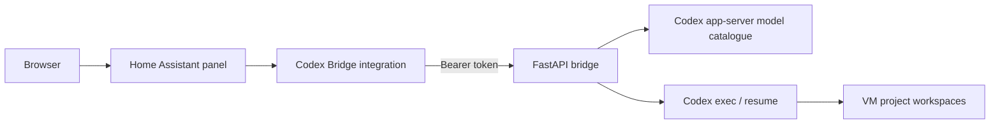

<div align="center">


# Home Assistant Codex Bridge

### Use Codex from Home Assistant while the agent, credentials, and workspaces stay on a dedicated machine.

[](https://github.com/Herbertmt978/ha-codex-bridge/releases/latest)
[](https://my.home-assistant.io/redirect/hacs_repository/?owner=Herbertmt978&repository=ha-codex-bridge&category=integration)


[Quick start](#quick-start) · [Features](#what-you-get) · [Automatic models](#automatic-model-discovery) · [Security](#security) · [Home Assistant app](#could-this-run-as-a-home-assistant-app) · [Uninstall](#uninstall) · [Development](#development)

</div>

---

Home Assistant is a convenient place to start a coding task, but Codex needs a real machine, persistent credentials, and access to real project folders. This bridge connects those two environments without exposing the Windows desktop or Codex CLI directly to the browser.

If you already use a remote development VM, the shape is familiar. The bridge adds a Home Assistant-native project/chat interface, authenticated proxying, artifact handling, and model discovery from the installed Codex CLI.

> [!IMPORTANT]
> **Trust and access:** the bridge can run Codex commands and read or write the workspaces you assign to it. It stores metadata, uploads, logs, and artifacts under its configured root. Home Assistant-to-bridge traffic carries a bearer token; keep plain HTTP on a trusted private network or place it behind HTTPS/private tunnelling. The integration panel, WebSocket commands, uploads, and downloads are restricted to Home Assistant administrators.

## Quick start

### Requirements

- Home Assistant with HACS, or permission to install a custom integration manually.
- A Windows machine or VM that stays online and can reach Home Assistant and OpenAI.
- Python 3.12 or newer.
- The [Codex CLI](https://github.com/openai/codex) installed and signed in on that Windows account.

### 1. Install the bridge on Windows

```powershell
git clone https://github.com/Herbertmt978/ha-codex-bridge.git C:\CodexHA\ha-codex-bridge
cd C:\CodexHA\ha-codex-bridge

py -3.12 -m venv C:\CodexHA\.venv
C:\CodexHA\.venv\Scripts\python.exe -m pip install `
  .\bridge_service\dist\codex_bridge_service-0.5.3-py3-none-any.whl
```

Generate a token and configure the process:

```powershell
$bridgeToken = & C:\CodexHA\.venv\Scripts\python.exe -c "import secrets; print(secrets.token_urlsafe(32))"

$env:CODEX_BRIDGE_HOST = "0.0.0.0"
$env:CODEX_BRIDGE_PORT = "8766"
$env:CODEX_BRIDGE_ROOT_PATH = "C:\CodexHA"
$env:CODEX_BRIDGE_AUTH_TOKEN = $bridgeToken
$env:CODEX_BRIDGE_CODEX_WRAPPER_PATH = "$env:LOCALAPPDATA\Programs\OpenAI\Codex\bin\codex.exe"

C:\CodexHA\.venv\Scripts\codex-bridge-service.exe
```

Store the token securely. The same value is entered in Home Assistant, and it must be at least 32 characters. Do not commit it or paste it into logs.

The example keeps Codex's normal sandbox behavior. On a disposable, isolated VM where the Windows sandbox helper is unavailable, you may opt into `CODEX_BRIDGE_BYPASS_SANDBOX=1`; doing so lets Codex access anything available to the Windows account, not just folders listed in the panel.

This is a foreground smoke start: closing PowerShell stops the bridge. Once it is verified, run the same command through Windows Task Scheduler or your service manager under the dedicated bridge account. Keep the environment/token launcher readable only by that account, start it at boot, and use `C:\CodexHA` as the working directory. This repository does not silently register the bridge itself as a Windows service.

### 2. Install the Home Assistant integration

Use the HACS badge above, or add this repository as a HACS custom repository with category **Integration**. Open **Codex Bridge** in HACS and choose **Download** before restarting Home Assistant.

Then:

1. Restart Home Assistant.
2. Open **Settings → Devices & services → Add integration**.
3. Search for **Codex Bridge**.
4. Enter the Windows bridge URL, token, and desired sidebar title.
5. Open **Codex Bridge** from the Home Assistant sidebar.

<details>
<summary><b>Manual Home Assistant installation</b></summary>

Copy `custom_components/codex_bridge` from this repository to:

```text
/config/custom_components/codex_bridge
```

Restart Home Assistant, then add **Codex Bridge** from **Settings → Devices & services**. Repeat the copy after each manual upgrade.

</details>

For example, Home Assistant might reach the VM at:

```text
http://192.168.1.50:8766
```

### 3. Confirm it is working

From the VM, a healthy authenticated bridge returns:

```powershell
$headers = @{ Authorization = "Bearer $env:CODEX_BRIDGE_AUTH_TOKEN" }

Invoke-RestMethod http://127.0.0.1:8766/ready -Headers $headers
# status
# ------
# ok

(Invoke-RestMethod http://127.0.0.1:8766/status -Headers $headers).model_catalog |
  Select-Object source, default_model, default_thinking_level, stale
# source             default_model  default_thinking_level stale
# ------             -------------  ---------------------- -----
# codex-app-server   gpt-5.6-sol    ultra                  False
```

The exact models come from the installed Codex CLI and can change independently of this README.

## What you get

| Area | Capability |
| --- | --- |
| Projects | Map Home Assistant projects to real VM folders and inherit project-level model/reasoning defaults. |
| Chats | Direct chats, project chats, per-chat overrides, archive/restore/delete, queued prompts, and cancellation. |
| Models | Runtime model discovery with each model's supported reasoning levels, cached last-known-good data, and safe fallback behavior. |
| Files | Folder uploads with relative paths, pasted screenshots, workspace archives, previews, and artifact downloads. |
| Visibility | Account/plan status, 5-hour and weekly limit snapshots, run progress, diagnostics, and tool availability. |
| Recovery | Device-code sign-in, explicit auth-expired states, idle-run watchdogs, and stale-run recovery after restart. |
| Security | Required bridge token plus Home Assistant administrator checks across the panel, WebSocket, upload, and download surfaces. |

## Automatic model discovery

The bridge asks the configured Codex app-server for its current model catalogue. The Home Assistant picker therefore follows the CLI instead of a hard-coded list:

- newly exposed models appear automatically;
- each model shows only its advertised reasoning levels;
- configured models temporarily missing from a response remain selectable;
- a last-known-good catalogue is used during transient failures;
- fallback-derived special-project defaults are marked provisional and replaced after discovery recovers, without changing chats created during the outage.

New projects inherit Codex's effective model and reasoning defaults. Existing chats keep explicit or materialized settings when a project default is migrated.

## Automatic Codex CLI updates

Install the included daily scheduled task from an elevated PowerShell prompt on the bridge VM. The registered task itself runs with limited privileges:

```powershell
powershell -NoProfile -ExecutionPolicy Bypass `
  -File .\scripts\Install-CodexAutoUpdate.ps1 `
  -CodexPath "$env:LOCALAPPDATA\Programs\OpenAI\Codex\bin\codex.exe" `
  -DailyAt "03:15" `
  -RunNow
```

The task runs with limited privileges. It pins the official installer to the configured directory, backs up supported launcher layouts, runs the update, and validates the bundled model catalogue. A failed update or smoke test triggers rollback.

Its sanitized log is written to:

```text
C:\CodexHA\logs\codex-update.log
```

Preview or uninstall the task:

```powershell
powershell -NoProfile -ExecutionPolicy Bypass `
  -File .\scripts\Install-CodexAutoUpdate.ps1 -WhatIf

powershell -NoProfile -ExecutionPolicy Bypass `
  -File .\scripts\Install-CodexAutoUpdate.ps1 -Uninstall
```

## How it works



The browser talks only to Home Assistant. The custom integration proxies authenticated commands to the bridge, and the bridge owns storage, Codex subprocesses, uploads, event history, and artifacts on the VM.

<details>
<summary><b>Repository layout</b></summary>

- `bridge_service/` — FastAPI service, storage, Codex process management, discovery, runner, and tests.
- `custom_components/codex_bridge/` — Home Assistant config flow, authenticated proxy APIs, panel registration, and frontend.
- `scripts/` — Windows Codex updater and scheduled-task installer.
- `brand/` — HACS and Home Assistant branding assets.
- `output/playwright/` — standalone panel harness used for browser smoke testing.

</details>

## Configuration reference

| Variable | Default | Purpose |
| --- | --- | --- |
| `CODEX_BRIDGE_HOST` | `127.0.0.1` | Listener address. Use `0.0.0.0` only on a trusted/private network. |
| `CODEX_BRIDGE_PORT` | `8766` | Bridge HTTP port. |
| `CODEX_BRIDGE_ROOT_PATH` | `C:/CodexHA` | Metadata, workspaces, uploads, artifacts, and logs. |
| `CODEX_BRIDGE_AUTH_TOKEN` | required | Random bearer token of at least 32 characters. |
| `CODEX_BRIDGE_CODEX_WRAPPER_PATH` | `codex` | Managed `codex.exe`, or a `.ps1`/`.py` wrapper. |
| `CODEX_BRIDGE_CODEX_HOME` | inferred | Optional explicit Codex configuration/auth directory. |
| `CODEX_BRIDGE_BYPASS_SANDBOX` | `0` | Passes the Codex full-access bypass flag; use only on an isolated VM. |
| `CODEX_BRIDGE_IGNORE_USER_CONFIG` | `0` | Starts Codex without inheriting user configuration. |
| `CODEX_BRIDGE_RUN_IDLE_TIMEOUT_SECONDS` | `1800` | Fails a run that stops producing output. |
| `CODEX_BRIDGE_MODEL_DISCOVERY_TIMEOUT_SECONDS` | `10` | App-server catalogue timeout. |
| `CODEX_BRIDGE_MODEL_CACHE_TTL_SECONDS` | `600` | Fresh catalogue cache lifetime; reserved recovery chats retry stale entries. |

<details>
<summary><b>Authentication recovery</b></summary>

If Codex reports an expired login or a WebSocket `401 Unauthorized`, the bridge exposes a VM sign-in action in Home Assistant. Start the device flow from the panel, complete the account approval in a browser that can reach ChatGPT, then refresh the auth status.

The bridge does not rotate or log Codex refresh tokens. Codex remains the owner of its authentication files.

</details>

<details>
<summary><b>Upgrade from an earlier release</b></summary>

Version 0.5.3 immediately retries a stale startup catalogue for Direct and Imported recovery chats. It also includes the 0.5.2 first-chat recovery and runtime-version fixes, the 0.5.1 Windows PowerShell updater fix, and the 0.5.0 dynamic-model, migration, and security changes.

1. Replace old placeholder or short bridge tokens in both the VM launcher and Home Assistant.
2. Update the VM checkout and install the 0.5.3 wheel.
3. Point `CODEX_BRIDGE_CODEX_WRAPPER_PATH` at the managed Codex executable.
4. Update or redownload version 0.5.3 in HACS.
5. Restart the bridge and Home Assistant, then hard-refresh the browser.

Back up `projects/` and `threads/` under the bridge root before the first 0.5.x start.

</details>

## Security

- Do not expose port `8766` directly to the public internet.
- Use a random token and keep the VM and Home Assistant values synchronized.
- Prefer a dedicated, non-administrator Windows account and an isolated VM.
- Enable `CODEX_BRIDGE_BYPASS_SANDBOX` only when the VM itself is the security boundary.
- Map projects narrowly; Codex can change files inside the workspaces it is allowed to use.
- Use HTTPS or a private tunnel when the Home Assistant-to-VM path is not fully trusted.
- Rotate the bridge token after suspected exposure and restart both ends.

To disable the system immediately, stop the bridge process. To remove it completely, remove the Home Assistant integration, uninstall the scheduled updater, uninstall `codex-bridge-service` from the VM environment, and delete the bridge root only after preserving any wanted workspaces/artifacts.

## Could this run as a Home Assistant app?

Yes. Home Assistant now calls add-ons **apps**, and the bridge can run in a Supervisor-managed Linux container. The Codex project publishes standalone Linux binaries for both `amd64` and `aarch64`, which match the two most useful Home Assistant app architectures.

The recommended design is a separate optional app package:

1. Build a versioned container with the bridge and a pinned Codex Linux binary.
2. Persist `CODEX_HOME`, authentication, and bridge metadata in the app's private writable `/data` volume.
3. Map only an explicit workspace such as `/share/codex-workspaces` read/write.
4. Keep protection mode enabled, provide an AppArmor profile, avoid host networking, and avoid mapping the full Home Assistant config directory.
5. Reuse the existing Home Assistant integration and panel, pointing it at the internal app service.
6. Handle ChatGPT device authentication through the existing panel and persist the resulting Codex auth state.

The main trade-offs are container memory/CPU use, headless authentication, limited access to folders outside Home Assistant, and Codex upgrades. For reproducibility, the app image should pin Codex and use automation to publish a new image when Codex releases, rather than downloading an unpinned executable on every start.

This repository does not ship that app yet. The Windows bridge remains the supported deployment path while the container permissions, persistence, multi-architecture build, and update lifecycle are designed and tested.

References: [Home Assistant app configuration](https://developers.home-assistant.io/docs/apps/configuration/), [Home Assistant app security](https://developers.home-assistant.io/docs/apps/security/), and [Codex CLI installation](https://github.com/openai/codex#installing-and-running-codex-cli).

## Uninstall

1. Remove the **Codex Bridge** integration from Home Assistant, then remove it from HACS (or delete the manually copied `custom_components/codex_bridge` folder) and restart Home Assistant.
2. Remove the CLI updater task:

   ```powershell
   powershell -NoProfile -ExecutionPolicy Bypass `
     -File .\scripts\Install-CodexAutoUpdate.ps1 -Uninstall
   ```

3. Stop and remove any bridge startup task/service, then uninstall the Python package:

   ```powershell
   C:\CodexHA\.venv\Scripts\python.exe -m pip uninstall -y codex-bridge-service
   ```

4. Preserve any wanted workspaces or artifacts before manually removing `C:\CodexHA`. Removing the integration or Python package does not delete project files.

## Dashboard launcher

The primary UI is a full Home Assistant panel. A dashboard button can link to it:

```yaml
type: button
name: Codex Bridge
icon: mdi:robot-outline
tap_action:
  action: navigate
  navigation_path: /codex-bridge
```

## Development

```powershell
python -m pip install -e ".\bridge_service[test]"
python -m pytest bridge_service\tests -q
python -m compileall -q bridge_service\src custom_components
node --check custom_components\codex_bridge\frontend\codex-bridge-panel.js
```

Updater tests use Windows PowerShell and include real junction rollback coverage.

## FAQ

<details>
<summary><b>Will new Codex models require another integration release?</b></summary>

Normally, no. The bridge reads the catalogue from the installed Codex CLI. A bridge update is needed only if the Codex protocol or bridge behavior changes.

</details>

<details>
<summary><b>Can I run the bridge on the same machine as Home Assistant?</b></summary>

Not with the current Windows deployment. A future Home Assistant app would make this possible on Home Assistant OS/Supervised installations.

</details>

<details>
<summary><b>Why does the model list say it is stale?</b></summary>

The latest discovery attempt failed, so the bridge is serving its last-known-good or fallback catalogue. Check the configured Codex path, Codex login, and bridge diagnostics.

</details>

## Contributing

Issues and pull requests are welcome. Keep changes focused, add regression coverage for behavior changes, and run the backend, JavaScript, and PowerShell checks before opening a PR.

## License

No license has been declared for this repository yet. Until one is added, normal copyright restrictions apply.
