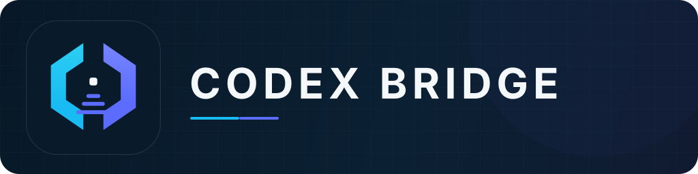

# Home Assistant Codex Bridge

Keep browser traffic on Home Assistant while a private HAOS App connects to
Codex/OpenAI from your home network.

[Installation](docs/installation.md) | [Capabilities](#automations-and-codex-capabilities) | [Chat activity](docs/chat-activity.md) | [Planned releases](docs/roadmap.md) | [Updates](#updates-and-recovery) | [Remote access](docs/remote-access.md) | [Backup and recovery](docs/backup-restore.md) | [Security](SECURITY.md) | [Support](SUPPORT.md)

## What it is

Codex Bridge lets you use Codex from a panel in Home Assistant. You can chat,
work with files in a private workspace, and schedule tasks using your ChatGPT
account. No OpenAI API key is needed.

Home Assistant handles access to the panel. A separate App runs Codex and keeps
its files and login state private. Your browser connects to Home Assistant;
it does not connect directly to the App.

## Two components, two installation paths

Install both components for the normal Home Assistant OS setup:

- **HACS Integration:** adds the Codex Bridge panel to Home Assistant.
- **Supervisor App:** runs Codex and the private Bridge service.

An optional third App, **Codex Host Access**, enables root work on Home Assistant
OS after an explicit warning and acknowledgement. It can access host files,
credentials, services and networking. It is not needed for normal use; read the
[installation and access guide](codex_host_access_app/DOCS.md) before enabling it.

For Home Assistant device and automation management, consider the community
[HA-MCP server](https://github.com/homeassistant-ai/ha-mcp) as an optional
companion. Our [connection guide](docs/home-assistant-mcp.md) explains how to
enable it in Bridge and choose a public HTTPS or optional local connection.

The App supports **Home Assistant OS on amd64**. You need administrator access,
HACS and a ChatGPT account with Codex access. Home Assistant Container cannot
run Supervisor Apps. An existing private external Bridge is an advanced
alternative; see [migration and external setup](docs/migration-from-windows.md).

This is a community custom repository. It is not an official Home Assistant
or HACS integration.

## Install and first run

1. Add this repository to HACS as an **Integration**, install **Codex Bridge**,
   and restart Home Assistant.
2. In **Settings → Apps → App store → Repositories**, add
   <https://github.com/Herbertmt978/HA_Codex_Bridge>. Install and start the
   **Codex Bridge** App.
3. In **Settings → Devices & services**, confirm the discovered **Codex
   Bridge** integration. You do not need to copy an address, port or token.
4. Open **Codex Bridge** from the sidebar. Choose **Sign in with ChatGPT**
   and complete the device login in the browser.
5. Choose **New chat**, or create a project to group related work. The App
   creates the private workspace. Upload the files you want Codex to use.

See [Installation](docs/installation.md) for the complete steps and update
troubleshooting. Home Assistant login and ChatGPT login are separate; initial
ChatGPT sign-in and re-authentication require access to the ChatGPT website.

## Automations and Codex capabilities

- **Chats and files:** use direct chats or organise work into projects. Model
  and reasoning choices come from the installed Codex runtime and your account.
  Astra appears when that runtime and account advertise it.
- **Scheduled tasks:** describe the task and timing in one sentence, then review
  the proposed schedule before creating it. You can also enter a title and instructions, choose a new or current
  chat, then set the frequency and time. Daily, weekdays, weekly, monthly,
  intervals and one-off tasks are supported. Times use Home Assistant's time
  zone. Read the [Scheduled guide](docs/scheduled-tasks.md).
- **Web search and images:** native tools are available when supported by the
  runtime and signed-in account. Check run activity for actual web searches;
  this does not give shell commands internet access.
- **Skills, plugins and instructions:** manage workspace skills, trusted
  marketplaces and global or project instructions from the panel. Review
  third-party content before using it.
- **MCP servers:** optional and disabled by default. Enable **Enable MCP** in
  the App configuration and restart it before adding a trusted HTTPS server.
  Local HTTP/HTTPS servers need **Enable local MCP connections** as well, plus
  acknowledgement of the endpoint's access and HTTP encryption warning.
  On amd64 Home Assistant OS, **Enable isolated stdio MCP servers** separately to
  review a verified, bundled Python package. New stdio connections start
  paused with no permitted tools. The first package has no network or
  workspace access. See [App documentation](codex_bridge_app/DOCS.md) for
  restrictions.
- **Settings:** save a light or dark appearance, chat text size, reduced motion
  and defaults for new chats. See [Panel settings](docs/panel-settings.md).
- **Chat controls:** stop or steer a running turn from the composer, check its
  context usage, and open files or links from the sidebar. Share copies a chat
  link that requires Home Assistant sign-in. The bottom panel includes an
  interactive workspace terminal. See [Chat controls](docs/chat-controls.md).
- **Assist conversation agent:** an administrator can opt in to direct Codex
  answers from one selected project. Assist requests are restricted to observe
  mode and are separate from ordinary device control. See the
  [Assist setup and access guide](docs/home-assistant-assist.md).

Scheduled work runs through Home Assistant, so your PC and browser do not need
to stay open. Home Assistant, the App and the ChatGPT session must remain
available. Tasks that overlap, miss their window or need an approval may be
skipped or stopped; check **Run history**. Results appear in chats and run
history. Scheduled-task notifications are opt-in: choose a generic Home
Assistant notification and/or specific Companion App phones in the task editor.
Answer previews on selected phones require a separate opt-in. See the
[Scheduled guide](docs/scheduled-tasks.md) for privacy and delivery limits.

## Updates and recovery

The Integration and App update separately. HACS updates the panel; the App
store updates Codex and the Bridge. Update both when the release notes call for
it, restart Home Assistant after an Integration update, and reload open panel
tabs. [Update steps and missing-update checks](docs/installation.md#update-an-existing-installation).

This release pairs App **1.8.3**, Integration and panel **1.8.3**, with Bridge **0.14.3**
and Codex **0.157.0**. It prepares ARM64 development builds; published images
remain **amd64-only** until native hardware qualification. It retains write-only
bearer tokens and API-key headers for MCP servers, public OAuth and opt-in local
HA-MCP connections. [ARM64 development status](docs/arm64-development.md).
Optional HAOS host access still
requires its separate App and explicit consent. Use the
[published release](https://github.com/Herbertmt978/HA_Codex_Bridge/releases/latest)
and [changelog](codex_bridge_app/CHANGELOG.md) to check available versions.

Dependabot maintains package and Actions dependencies. A separate daily
workflow checks for stable Codex runtimes, verifies their downloads and opens
tested update PRs. A runtime update still needs a published App image before
Home Assistant can install it. [Updater setup](docs/development.md#verified-updater-setup).

Make a [cold backup](docs/backup-restore.md) before updating the App. The public
App is distributed as a signed, immutable image with SBOM and provenance
verification. Arbitrary App-image rollback is not validated; do not assume
Supervisor can select an arbitrary earlier App image.

## Security boundary

Codex works only within the selected App workspace. This is not Home
Assistant's configuration directory, and installing the App does not grant
Codex general access to your home devices, host files or LAN. Observe mode is
read-only; Edit and Full auto permit workspace changes. Full auto does not
remove the filesystem or network restrictions.

Publish Home Assistant only. Nabu Casa, Cloudflare or another HTTPS reverse
proxy must terminate at Home Assistant; keep the App and Bridge private.
Read [Remote access](docs/remote-access.md) and [Security](SECURITY.md).

The optional browser worker can open public websites, interact with pages and
save screenshots or PDFs to the chat. Enable **Enable browser tools** in the
App's Configuration tab, restart the App, then start a new chat. Its startup
checks must pass before Codex receives the tools. It cannot open your Home
Assistant or other local devices, use your existing browser login, or retain
a browser session between turns. See [Browser tools](docs/browser-tools.md).

Native web search and local file previews are separate features. External
proxy routes and cold restores still need the target-specific checks in the
acceptance guides.

For help, see [Support](SUPPORT.md). For development, see
[Development](docs/development.md) and [Contributing](CONTRIBUTING.md).
The project uses the [MIT licence](LICENSE); third-party attribution is in
[THIRD_PARTY_NOTICES.md](THIRD_PARTY_NOTICES.md).
