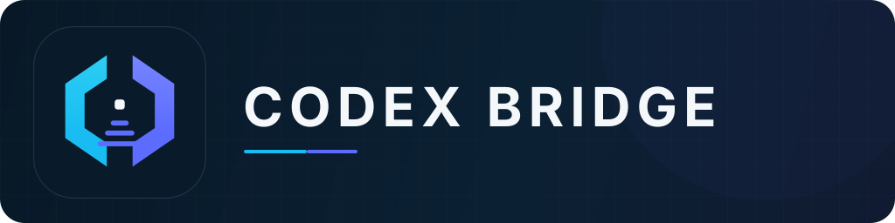

# Home Assistant Codex Bridge

**Codex, always available inside Home Assistant.**

Chat, work with files, manage projects and schedule tasks from your Home Assistant
sidebar. Your Home Assistant runs the app, so your PC does not need to stay on.

[Installation](docs/installation.md) | [Capabilities](#automations-and-codex-capabilities) | [Chat activity](docs/chat-activity.md) | [All guides](docs/README.md) | [Updates](#updates-and-recovery) | [Remote access](docs/remote-access.md) | [Backup and recovery](docs/backup-restore.md) | [Security](SECURITY.md) | [Support](SUPPORT.md)

## What it is

Codex Bridge brings an always-on Codex workspace to Home Assistant. Pick up a
chat from your laptop or phone, work on a project, or let a scheduled task run
while your computer is switched off. Your chats, files and task history stay
with the App.

Sign in with your ChatGPT account: no OpenAI API key is needed. The App runs
inside Home Assistant OS; AI processing uses OpenAI's cloud. Home Assistant,
the App, internet access and a valid ChatGPT session must remain available for
tasks to run.

Home Assistant handles access to the panel. Your browser connects to Home
Assistant, which talks to the private App. Use your existing Home Assistant
remote-access route when you are away from home.

## Why Codex Bridge?

- **Ready when you need it:** keep Codex available on your Home Assistant machine,
  with no desktop app or always-on PC required.
- **A workspace for real tasks:** organise chats into projects, upload files,
  review changes and carry useful context from one conversation to another.
- **Work on your schedule:** run recurring or one-off tasks through Home Assistant,
  then read the results in your chats and run history.
- **Connected to your home, when you choose:** enable built-in Home Assistant MCP
  tools, a supported community HA-MCP connection, or both. Choose the tools Codex
  can use and configure Assist separately.
- **Familiar Home Assistant access:** open everything from the sidebar and keep
  the App behind Home Assistant's sign-in and remote-access setup.

## Two components, two installation paths

Install both components for the normal Home Assistant OS setup:

- **HACS Integration:** adds the Codex Bridge panel to Home Assistant.
- **Supervisor App:** runs Codex and the private Bridge service.

An optional third App, **Codex Host Access**, enables root work on Home Assistant
OS after an explicit warning and acknowledgement. It can access host files,
credentials, services and networking. It is not needed for normal use; read the
[installation and access guide](codex_host_access_app/DOCS.md) before enabling it.

For Home Assistant device and automation management, consider the community
[HA-MCP server](https://github.com/homeassistant-ai/ha-mcp) as an optional
companion. Our [connection guide](docs/home-assistant-mcp.md) explains how to
enable it in Bridge and choose a public HTTPS or optional local connection.
When Home Assistant's built-in MCP Server integration is installed, use the
**Use Home Assistant tools** switch in **Settings → MCP servers**. The community
connection has its own switch, so you can choose which tool set to use.

The App supports **Home Assistant OS on amd64**. You need administrator access,
HACS and a ChatGPT account with Codex access. Home Assistant Container cannot
run Supervisor Apps. An existing private external Bridge is an advanced
alternative; see [migration and external setup](docs/migration-from-windows.md).

This is a community custom repository. It is not an official Home Assistant
or HACS integration.

## Install and first run

1. Add this repository to HACS as an **Integration**, install **Codex Bridge**,
   and restart Home Assistant.
2. In **Settings → Apps → App store → Repositories**, add
   <https://github.com/Herbertmt978/HA_Codex_Bridge>. Install and start the
   **Codex Bridge** App.
3. In **Settings → Devices & services**, confirm the discovered **Codex
   Bridge** integration. You do not need to copy an address, port or token.
4. Open **Codex Bridge** from the sidebar. Choose **Sign in with ChatGPT**
   and complete the device login in the browser.
5. Choose **New chat**, or create a project to group related work. The App
   creates the private workspace. Upload the files you want Codex to use.

See [Installation](docs/installation.md) for the complete steps and update
troubleshooting. Home Assistant login and ChatGPT login are separate; initial
ChatGPT sign-in and re-authentication require access to the ChatGPT website.

## Automations and Codex capabilities

### Chats and projects

Keep direct chats or organise related work into projects. Pin chats, mark them
unread, organise sidebar sections, and archive or restore conversations. HA
Assistant Chats sit in their own group at the bottom, collapsed by default.

Read formatted answers with Markdown, tables, code blocks and maths. Copy code,
copy messages or quote a selected passage. Search retained conversations or use
Find within the current chat. Browser-local draft recovery helps you pick up an
unfinished prompt. Model and reasoning choices come from your Codex runtime and
signed-in account.

[Chat controls](docs/chat-controls.md) · [Conversation features](docs/selected-enhancements.md)
· [Maths](docs/assistant-maths.md)

### Files, context and Git

Upload and work with files in a private workspace, open supported previews and
use the workspace terminal. Add a file, selected lines or previous-chat passages
to a prompt, with a preview of exactly what will be sent. Changed source content
requires a fresh review before submission.

Review repository status, branches and Git diffs from the panel. These views
inspect the selected workspace repository; they do not grant access to other
folders. Share a chat link with someone who can sign in to Home Assistant, or
copy the available conversation as text or Markdown.

[Workspace context](docs/workspace-context.md) · [Previous-chat context](docs/previous-chat-context.md)
· [Git status](docs/repository-status.md) · [Files and terminal](docs/chat-controls.md)

### Control longer tasks

Stop a turn, steer its current work, or queue a separate follow-up. Review a plan
before choosing to implement it. Track context usage and find chats needing your
attention in the inbox.

Save a goal with success criteria and track progress across turns. Goals move
forward when you send a prompt; they do not silently start background work.
Inspect available child-agent activity and stop a verified running child where
supported. Direct child follow-up is not supported by the bundled runtime.

View reported token usage and set an optional elapsed-time limit for a turn.
Usage history is partial runtime telemetry, not a bill or a guaranteed token cap;
stopping a turn can take time.

[Goals](docs/durable-goals.md) · [Attention inbox](docs/attention-inbox.md)
· [Child agents](docs/individual-subagents.md) · [Usage and time limits](docs/task-usage-budgets.md)

### Scheduled work and notifications

Describe a task and its timing, review the proposed schedule, then save it. Or
use the editor for daily, weekday, weekly, monthly, interval and one-off tasks.
Schedules follow Home Assistant's time zone and run without your browser or PC.

Read outcomes in chats and run history. Opt in to Home Assistant notifications
or selected Companion App phones, with a separate choice for answer previews.
Overlapping runs, missed windows and tasks needing approval can be skipped or
stopped, with the outcome recorded.

Optional question notifications let verified administrator Companion devices
answer existing questions. A reply does not approve execution or grant access.
Phone delivery depends on your device and notification setup.

[Scheduled tasks](docs/scheduled-tasks.md) · [Question notifications](docs/question-notifications.md)

### Home Assistant tools and Assist

Use the switches in **Settings → MCP servers** to connect the installed built-in
Home Assistant MCP integration or the supported community HA-MCP App. If both
are installed, choose either or both. The setup explains the access being enabled.

Choose **Select all tools** for the current catalogue, or **Select individual
tools** to open the list and pick your own. Newly added or renamed tools still
need approval. A saved connection and the permissions for using it are separate;
the settings show what remains to be enabled.

Configure Codex as an optional Assist conversation agent, with its own selected
MCP servers. Assist's workspace is read-only, but authorised MCP tools can still
control devices. Ordinary chat and Assist tool choices are separate.

Home Assistant entities expose connection health, task state and available usage
allowances. Saved ChatGPT accounts have their own allowance and reset entities;
missing or stale usage is shown as unknown. Integration actions can start,
continue, cancel and inspect tasks within their documented permission limits.

[Home Assistant MCP](docs/home-assistant-mcp.md) · [Assist](docs/home-assistant-assist.md)
· [Status entities](docs/status-entities.md) · [Account entities](docs/account-profile-allowances.md)
· [Task actions and limits](docs/home-assistant-task-actions.md)

### Accounts, tools and personal settings

- **ChatGPT accounts:** save and switch App sign-ins while retaining local chats,
  projects and files. The selected account applies across the App, not per task.
- **Skills, plugins and instructions:** manage workspace skills, trusted
  marketplaces and global or project instructions from the panel.
- **Web search and images:** use native capabilities when your runtime and account
  support them. Choose web-search behaviour for the next prompt.
- **Browser tools:** optionally browse public websites and save screenshots or
  PDFs. The isolated browser does not use your personal browser session or open
  local Home Assistant pages.
- **MCP connections:** manage public HTTPS servers, supported authentication and
  interactive requests, or explicitly enable local connections. Pause, resume
  and diagnose connections, and choose their allowed tools. Separately enabled
  isolated stdio support is limited to verified bundled packages.
- **Appearance and defaults:** choose Home Assistant, light or dark appearance,
  text size, reduced motion and defaults for new chats.
- **Optional host access:** a separate companion App supports explicitly granted
  HAOS root work. It is not needed for normal chats or MCP home control.

[Accounts](docs/account-profiles.md) · [Search choices](docs/per-turn-web-search.md)
· [Browser tools](docs/browser-tools.md) · [Settings](docs/panel-settings.md)
· [App options](codex_bridge_app/DOCS.md) · [Host access](codex_host_access_app/DOCS.md)

## Common questions

**Does my PC need to stay on?** No. The App runs on your Home Assistant OS
machine. Scheduled work needs Home Assistant, the App, internet access and a
working ChatGPT session.

**Is the AI running locally?** The App, workspaces and local history run on your
machine. Codex sends requests to OpenAI for AI processing; this is not offline
or local-model inference.

**Can it control my home?** Yes, through the Home Assistant MCP tools you choose
to enable. Installing Bridge alone does not grant access to devices, HA
configuration or host files.

**Does it need an API key?** No OpenAI API key is needed for Codex. Sign in with a
ChatGPT account that has Codex access. Optional third-party tools may have their
own authentication and costs.

**Can I use a Raspberry Pi?** The published App currently supports amd64 Home
Assistant OS. The core ARM64 build support is already coded and has passed build
and emulation checks. It still needs testing on real ARM64 Home Assistant OS
hardware before a stable release. Browser tools and the Host Access App are not
included in that ARM64 support. See [ARM64 testing status](docs/arm64-development.md).

**Does it sync with the desktop Codex app?** App accounts, chats and workspaces
are separate. Sharing uses chat links that require Home Assistant sign-in;
anonymous chat snapshots are not supported.

## Updates and recovery

The Integration and App update separately. HACS updates the panel; the App
store updates Codex and the Bridge. Update both when the release notes call for
it, restart Home Assistant after an Integration update, and reload open panel
tabs. [Update steps and missing-update checks](docs/installation.md#update-an-existing-installation).

Assist conversations appear in the **HA Assistant Chats** sidebar group, separately
from ordinary projects. Assist-only projects keep their project actions inside
this group, including restore and delete actions when archived. Their workspace
and history are retained; continue their messages through Home Assistant Assist.

This release pairs App **1.13.12**, Integration and panel **1.13.12**, with Bridge **0.20.1**
and Codex **0.160.0**. Long chat replies and fenced code retain their complete
source within the Bridge's existing limits. Assistant Markdown, transcript search, explicit Queue/Steer, native Plan
and scoped Git review are described in [the conversation controls guide](docs/selected-enhancements.md). Core ARM64 build support is implemented and awaits testing on real ARM64
Home Assistant OS hardware; published images remain **amd64-only** until that
testing passes. It retains write-only
bearer tokens and API-key headers for MCP servers, public OAuth and opt-in local
HA-MCP connections. [ARM64 development status](docs/arm64-development.md).
Settings now use roomier controls and shorter, clearer guidance across every tab.
The MCP tool picker can allow all currently shown tools without opening the individual list.
Optional HAOS host access still
requires its separate App and explicit consent. Use the
[published release](https://github.com/Herbertmt978/HA_Codex_Bridge/releases/latest)
and [changelog](codex_bridge_app/CHANGELOG.md) to check available versions.

Dependabot maintains package and Actions dependencies. A separate daily
workflow checks for stable Codex runtimes, verifies their downloads and opens
tested update PRs. A runtime update still needs a published App image before
Home Assistant can install it. [Updater setup](docs/development.md#verified-updater-setup).

Make a [cold backup](docs/backup-restore.md) before updating the App. The public
App is distributed as a signed, immutable image with SBOM and provenance
verification. Arbitrary App-image rollback is not validated; do not assume
Supervisor can select an arbitrary earlier App image.

## Security boundary

Codex works only within the selected App workspace. This is not Home
Assistant's configuration directory, and installing the App does not grant
Codex general access to your home devices, host files or LAN. Observe mode keeps the workspace
read-only; authorised MCP tools have their own permissions and may change devices
or other services. Edit and Full auto permit workspace changes. Full auto does not
remove the filesystem or network restrictions.

Publish Home Assistant only. Nabu Casa, Cloudflare or another HTTPS reverse
proxy must terminate at Home Assistant; keep the App and Bridge private.
Read [Remote access](docs/remote-access.md) and [Security](SECURITY.md).

The optional browser worker can open public websites, interact with pages and
save screenshots or PDFs to the chat. Enable **Enable browser tools** in the
App's Configuration tab, restart the App, then start a new chat. Its startup
checks must pass before Codex receives the tools. It cannot open your Home
Assistant or other local devices, use your existing browser login, or retain
a browser session between turns. See [Browser tools](docs/browser-tools.md).

Native web search and local file previews are separate features. External
proxy routes and cold restores still need the target-specific checks in the
acceptance guides.

For help, see [Support](SUPPORT.md). For development, see
[Development](docs/development.md) and [Contributing](CONTRIBUTING.md).
The project uses the [MIT licence](LICENSE); third-party attribution is in
[THIRD_PARTY_NOTICES.md](THIRD_PARTY_NOTICES.md).
