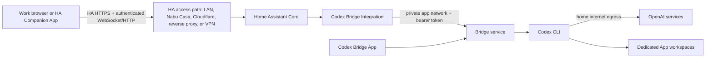

# Home Assistant-native Codex Design

**Status:** Proposed — awaiting user review

**Date:** 2026-07-12

**Target:** First experimental HA-native release, followed by verified VM retirement

**License decision:** Project code is MIT licensed; bundled OpenAI Codex retains its separate Apache-2.0 notices.

## Decision summary

Home Assistant Codex Bridge will become one cohesive project with two Home Assistant installation surfaces:

1. a Supervisor-managed **App** is the canonical owner of the Bridge, Codex CLI, credentials, metadata, and workspaces; and
2. the HACS **Integration** and its native panel are the only user-facing control surface.

This split is imposed by Home Assistant: HACS installs integrations while Supervisor installs Apps. The experience will still behave as one setup because the App publishes Supervisor discovery data and the Integration pairs automatically. Users will not enter a Bridge URL, expose a port, or copy a token in the primary flow.

The immediate goal is a reliable system for the repository owner. Official Home Assistant and Community Apps conventions are adopted where they improve security, maintainability, and portability; Community acceptance and Community-specific release machinery are not design constraints.

## Working artifacts

### TaskIntentDraft

- **Outcome:** Codex runs entirely on Home Assistant OS and is usable through the normal HA frontend over LAN, Nabu Casa, Cloudflare Tunnel/reverse proxy, VPN, or another standards-compatible HA access path.
- **Goal:** Remove the Windows VM as the runtime owner without weakening authentication, sandboxing, streaming, or rollback behavior.
- **Success evidence:** A real remote session from an authorized network that cannot reach OpenAI can sign in, create a workspace/chat, stream and approve/cancel a Codex run, upload and download a file, recover from a dropped connection, update Codex, and restore the prior App version—all through Home Assistant.
- **Stop condition:** The HA App is the verified canonical runtime, selected workspace files are present, fresh HA chat history is working, and the Windows service can be shut down without losing wanted data.
- **Non-goals:** Migrating VM chat/project history or Codex credentials; official Community acceptance; exposing Codex directly to browsers; arbitrary access to HA or host files.
- **Primary risks:** Nested Linux sandbox support on HA OS; secret leakage into Codex subprocesses; auth/run races; remote-stream interruption; HACS/App version skew; automatic upstream supply-chain compromise.

### BaselineReadSetHint

- `CONTEXT.md`
- `docs/aegis/baseline/2026-07-12-initial-baseline.md`
- `README.md`
- `bridge_service/src/codex_bridge_service/{app,settings,storage,runner,codex_process,codex_auth,model_catalog}.py`
- `bridge_service/src/codex_bridge_service/routes/`
- `custom_components/codex_bridge/{config_flow,bridge_api,runtime,websocket_api,http,panel}.py`
- `custom_components/codex_bridge/frontend/codex-bridge-panel.js`
- `bridge_service/tests/`
- Current Home Assistant App configuration, communication, security, publishing, repository, and test documentation
- Current OpenAI Codex authentication, app-server, sandbox, and release documentation

### ImpactStatementDraft

- **Affected layers:** packaging, process runtime, networking, authentication, storage, HA setup, transport, panel UX, CI/release, documentation, and rollback.
- **New canonical owners:** App for runtime; Integration for HA authorization/proxying; panel for user interaction; lock file/workflow for bundled Codex version.
- **Invariants:** browser talks only to HA; model-controlled tools cannot reach HA/LAN/internet or read credentials; workspaces cannot escape their root; auth changes and runs cannot race; no approval waits on hidden stdin; fallback models remain provisional; updates are immutable and reversible.
- **Compatibility:** manual external Bridge setup remains advanced/deprecated for a bounded 0.6.x rollback window; no automatic VM deletion or data move.
- **Explicit exclusions:** no ingress UI, no direct App port, no `/homeassistant` mount, no runtime `npm install` or CLI self-update, no unsafe sandbox bypass.

## Approaches considered

### A. HACS Integration plus Supervisor App — selected

The existing HA panel remains the product UI. A protected App owns Codex locally, and Supervisor discovery joins the two components.

**Advantages:** Meets the provider-neutral remote HA workflow; reuses the strongest existing UI and HA authorization boundary; keeps browser traffic on the current HA origin; supports background runtime and immutable updates; remains portable to Community-quality packaging.

**Costs:** Two installation actions are unavoidable, and Integration/App protocol compatibility must tolerate version skew.

### B. App with Ingress-only UI

Put the UI inside the App and expose it through HA Ingress.

**Advantages:** One Supervisor installation and native remote routing.

**Rejected because:** It discards the HACS Integration, duplicates HA panel work, weakens structured Core-side authorization/proxy contracts, and optimizes for an official-App shape rather than this user's desired HA UI.

### C. Keep the Windows VM and improve tunnelling

Retain the current Bridge and use HA only as a proxy.

**Advantages:** Known sandbox and filesystem behavior; smallest runtime change.

**Rejected because:** It does not remove the always-on VM, preserves split update/auth ownership, and fails the stated self-contained HA goal.

## End-to-end architecture



### Network invariant

The browser must make requests only to its current Home Assistant origin. It must never receive the Bridge address/token or call the App/OpenAI directly. Home Assistant authenticates the user, requires an administrator, validates command shapes, and proxies streaming and binary data to the App.

The access layer may be direct LAN, Nabu Casa, Cloudflare Tunnel/reverse proxy, a VPN, or another standards-compatible route to Home Assistant. The Integration and panel use same-origin relative HA URLs and contain no Nabu Casa or Cloudflare dependency. The App-to-OpenAI connection leaves from the user's home network; the browser access proxy is not an OpenAI egress proxy. This allows a network that blocks OpenAI but permits the user's HA frontend to use Codex through HA.

A supported access path must carry Home Assistant authentication, `/api/websocket` upgrades and long-lived bidirectional frames, streamed/chunked authenticated HTTP uploads and downloads, range/error responses, and normal HA security headers without exposing or rewriting the App endpoint. Proxy-specific credentials stay between the browser and that proxy and are never forwarded to the Bridge or Codex. Idle timeouts are handled by heartbeats plus replay cursors, not provider-specific browser code.

First-time device authorization is the deliberate exception to normal operation: the panel initiates and displays the short-lived device code, but the OpenAI approval page must be completed on a device/network that can reach OpenAI. No reusable OpenAI access or refresh token is sent to the work browser.

This routing solves a technical reachability problem; it does not override an employer's acceptable-use, confidentiality, security, or data-transfer policy. Work/customer code and prompts may be used only when the user is authorized to send them through personal Home Assistant and OpenAI. Testing on the actual work network occurs only if permitted; otherwise acceptance uses a controlled network that blocks OpenAI while allowing the configured HA URL.

## Repository and release shape

The repository remains one project and one source of truth:

```text
repository.yaml
hacs.json
custom_components/codex_bridge/       # Integration and panel
bridge_service/                        # canonical Bridge Python package and tests
codex_bridge_app/                     # App metadata and runtime target
  config.yaml
  Dockerfile
  apparmor.txt
  DOCS.md / README.md / CHANGELOG.md
  rootfs/
  codex-release.json                  # exact upstream assets and digests
docs/
```

The existing Bridge package remains at the repository root as its canonical source. The prebuilt-image workflow stages a wheel and App files into a temporary Docker context; no generated wheel or duplicate source is committed. This minimizes migration churn. If Community submission later becomes real, extracting or moving the Bridge into a dedicated App repository is a separate reviewed change rather than a constraint on the first working deployment.

Integration, Bridge, App package, bundled Codex, and API contract versions are reported separately. HACS releases occur only when the Integration changes; Codex-only updates increment the App package version and rebuild its image without manufacturing a HACS release. The Integration and Bridge each advertise supported API minimum/maximum versions and pair only when their ranges overlap. Compatibility tests cover old Integration → new App and new Integration → previous App.

## App design

### Supervisor configuration

- `slug: codex_bridge`, `startup: application`, `boot: auto`, `init: false`.
- Experimental stage until real HA OS acceptance and rollback evidence pass.
- Advertise only the owner's actual HA architecture for the first working release, after its real-system sandbox probe passes. Add `amd64` or `aarch64` as a follow-up only after that architecture has equivalent evidence.
- Use a pinned Home Assistant base image and explicit `FROM`; do not rely on legacy `BUILD_FROM` defaults.
- Use a prebuilt, signed GHCR image with an exact App version tag; publish a multi-architecture manifest only when every listed architecture has equivalent evidence.
- No host networking, exposed host port, Ingress, Docker socket, USB/device access, `full_access`, or Supervisor manager/admin role.
- Use protection mode and a custom AppArmor profile.
- Use cold backups so credentials, Bridge state, and user workspaces form a consistent restore point.

### Persistent data

| Container path | Contents | Exposure |
|----------------|----------|----------|
| `/data/codex-home` | `auth.json` and Codex-owned configuration/cache | App-private, never served or logged |
| `/data/bridge` | projects, chats, event cursors, uploads, artifacts, migrations | App-private |
| `/data/bridge-token` | generated Integration-to-Bridge bearer token | mode `0600`, disclosed only via Supervisor discovery |
| `/config/workspaces` | user-selected repositories and working files | dedicated `addon_config:rw` mapping only |

`addon_config` is the App's own public configuration area mounted at `/config`; it is not Home Assistant's main configuration directory. The App must not request `homeassistant_config`, `share`, or `all_addon_configs` access.

The App sets `CODEX_HOME=/data/codex-home` and `cli_auth_credentials_store = "file"`. The directory is mode `0700`, credential files are mode `0600`, and startup rejects unsafe ownership/modes or a non-atomic credential state rather than attempting to log its contents.

### Bootstrap and discovery

On first start, the App generates a cryptographically random Bridge token, initializes private directories with restrictive permissions, starts one Bridge worker, waits for authenticated readiness, and publishes Supervisor discovery service `codex_bridge` with host, internal port, token, and API version. It republishes on every start so installation order and recovery are predictable.

Only the short-lived root bootstrap process may use `SUPERVISOR_TOKEN` to publish discovery. It then unsets the token and launches the long-lived runtime as a dedicated non-root user with a sanitized environment. The Bridge reads its own bearer token from a mode-`0600` file owned by that runtime user rather than an environment variable. The AppArmor/bubblewrap design must prevent sandboxed tools from reading the trusted parent process environment or `/proc/*/environ`. Neither Supervisor nor Bridge credentials may appear in any Codex/tool environment.

The startup process must not print the token or `auth.json`, and health output must distinguish initialization, ready, auth-required, degraded-model-catalogue, and fatal-sandbox states.

## Integration design

- Add `async_step_hassio` for `codex_bridge` Supervisor discovery.
- Validate the discovery source, service name, App slug, private-network endpoint, bearer token, and overlapping API range before creating or updating a single config entry.
- Prefer the discovered App automatically; retain the current URL/token user step only under an explicit advanced external-Bridge route during 0.6.x.
- Store the token only in Home Assistant config-entry data. Never forward it to the panel or diagnostics.
- Disable redirects on authenticated Bridge requests and compare bearer tokens in constant time.
- Support explicit administrator-requested token rotation and suspected-exposure recovery: the App writes the new token atomically, republishes discovery, and the Integration replaces config-entry data without logging either value.
- Maintain one Bridge event consumer per config entry and fan out authorized subscriptions to panel connections.
- Cancel consumers and close HTTP responses on unload/reload/shutdown.
- Apply explicit connect, read, total, and idle timeouts with typed errors.
- Require a Home Assistant administrator for every WebSocket command and HTTP upload/download.
- Do not place prompts, responses, filenames, device codes, tokens, or auth claims in HA state, the event bus, logbook, or routine logs.

### Exact installation and discovery sequence

1. Add/install the Codex Bridge Integration in HACS and restart Home Assistant so the discovery handler exists.
2. Add this same GitHub repository to the HA App Store, install the Codex Bridge App, and start it.
3. The ready App publishes Supervisor discovery; HA presents a discovered Codex Bridge Integration with no URL/token fields.
4. The administrator confirms the discovered entry. Only then is the Codex panel registered and shown in the sidebar.
5. The panel opens its account/workspace first-run checklist and proceeds to device login.

If the user opens the Integration's manual Add flow before the App is ready, the primary form shows App installation/start guidance and a retry action; it does not fall back to asking for a token. If the App was installed first, restarting it republishes discovery. A fresh-install test must cover these steps from empty HACS/App state through the first chat.

## Remote transport design

### Text and state events

The panel subscribes through Home Assistant's authenticated WebSocket API. The Integration forwards normalized Bridge events with monotonic cursors and heartbeats. The Bridge retains replayable events, so after an access-proxy interruption or intermediary idle timeout the panel resubscribes from its last acknowledged cursor and receives missed output without duplicating completed events.

Auth events have their own subscription and work even when no project/chat exists. Slow clients receive bounded batches; a cursor gap triggers a clean snapshot-and-resume flow rather than unbounded in-memory queues.

### Files and artifacts

Binary traffic uses authenticated Home Assistant HTTP views, not base64 WebSocket frames. Uploads use resumable, idempotent 8 MiB chunks with per-chunk and final checksums so common proxy body limits or disconnects do not restart a complete workspace transfer. Downloads stream and support safe range resume. Neither direction writes complete payloads into Home Assistant Core temporary storage or buffers whole artifacts in memory. The Bridge validates filenames, relative paths, declared/observed sizes, and workspace confinement. User-visible limits and retry behavior must be explicit.

All model output, filenames, model labels, diffs, links, and artifact metadata are untrusted. The panel renders transcript/diff content as text or through a reviewed sanitizer, permits only explicit safe link schemes, and never embeds/prefetches remote content. Downloads use a sanitized filename, `Content-Disposition: attachment`, `application/octet-stream` unless an explicitly safe preview endpoint is used, and `X-Content-Type-Options: nosniff`. XSS tests cover stored and streaming payloads on the HA administrator origin.

Automated transport tests run through a reference reverse proxy with WebSocket upgrades, realistic idle timeouts, and bounded request bodies. Real-system acceptance uses the owner's configured external HA URL for a representative folder upload and artifact download. A documented Cloudflare Tunnel path and Nabu Casa path must use the same Integration code; local-only success is insufficient.

### Resource bounds

The initial single-user defaults protect the shared HA host:

- one active Codex turn and at most eight queued prompts;
- four-hour total and ten-minute idle run limits, with forced termination 15 seconds after cancellation;
- 100 MiB per uploaded file;
- archives limited to 20,000 entries, 2 GiB expanded size, and a 100:1 expansion ratio;
- 10 GiB total workspace storage and 2 GiB combined upload/artifact storage, exposed as documented App options with free-space checks;
- 25,000 retained events or 50 MiB per chat before snapshot/compaction; and
- ten 10 MiB rotated service logs with content-redacted defaults.

Limits are enforced before mutation when size metadata is trustworthy and continuously while streaming/expanding otherwise. Quota exhaustion, zip bombs, event floods, slow clients, and stuck cancellation have explicit tests and never exhaust Home Assistant Core memory or disk.

## Workspace confinement

- `/config/workspaces` is the only user project root in the App deployment.
- The API and panel expose workspace names/relative paths, not arbitrary absolute path entry.
- Every create, browse, upload, archive, and run path is resolved and verified as a descendant of the workspace root.
- Symlink traversal, archive path traversal, special files, and rename races must be rejected.
- Codex's working directory and additional writable directories remain within the selected workspace.
- Selected files are copied fresh from the VM; old chat/project metadata and credentials are not imported.
- Workspace import is supported through the HA UI and documented App config folder. Automatic host/VM crawling is out of scope.

## Codex authentication

Human CLI stdout parsing is replaced with the structured Codex app-server account protocol:

- `account/read` reconciles persisted login on startup and after restart.
- `account/login/start` with `chatgptDeviceCode` yields the verification URL and user code.
- `account/login/completed` and `account/updated` drive live state.
- `account/login/cancel` cancels an in-progress flow.
- `account/logout`, followed by `account/read`, verifies sign-out.

### Supported account mode

The first HA-native release supports only Codex's recommended ChatGPT-managed account mode:

- Start `account/login/start` with `type: "chatgptDeviceCode"`.
- Require the resulting `account/updated.authMode` to be `chatgpt` and display the safe `planType` when OpenAI supplies it.
- Let Codex persist and refresh the account's managed OAuth access/refresh tokens in private `auth.json`.
- Do not request, accept, store, expose, or document an OpenAI API key, `OPENAI_API_KEY`, API-key billing, or the app-server `apiKey` login RPC.
- Do not support externally supplied personal access tokens in the first release.

If startup detects `apiKey` or `personalAccessToken` auth mode, the Bridge blocks runs and asks the administrator to sign out and complete ChatGPT device login. The panel describes this as **Sign in with ChatGPT**, not “enter a token.” Device-code authorization may need to be enabled in the user's ChatGPT security settings or by their ChatGPT workspace administrator.

A single `CodexAuthCoordinator` serializes operations. Each operation has an internal generation identifier and the app-server `loginId`; notifications must match both before changing state, so stale process/event updates are ignored. The public record has a monotonic `revision`, normalized state, `busy`, safe message, device code/URL only while active, and no raw output or credentials. Every occurrence—including a repeated expiry/error with identical text—advances the revision.

Starting a login does not implicitly log out the current ChatGPT account. Account switching is an explicit sign-out followed by sign-in. Login, logout, and active Codex runs share a runtime gate: auth mutation returns a clear conflict while a run is active, and new runs wait or fail clearly while auth is changing. Cancel/logout settle through a final `account/read`. Shutdown cancels login, terminates its process group, and prevents late state writes.

The panel provides live **Sign in**, **Cancel sign-in**, and confirmed **Sign out** actions. It explains that a phone can complete the approval when the work network blocks OpenAI. Terminal states clear the device code and URL.

## Codex execution, approvals, and secret isolation

One supervised Codex app-server process owns account, model, thread, turn, streaming, cancellation, and approval protocol interactions. The Bridge is its typed broker: it maps persisted HA chat IDs to Codex thread IDs, normalizes app-server events, and resumes/reconciles after process or App restart. This replaces `codex exec --json` for normal App runs so no prompt, approval, or user-input request can wait on invisible terminal stdin.

The three panel modes have explicit behavior:

| Mode | Sandbox | Approval behavior |
|------|---------|-------------------|
| Observe | read-only | Requests are surfaced in HA; approval cannot add write or network access. |
| Edit | workspace-write | Command/patch requests are surfaced in HA; approval remains inside the selected workspace and cannot grant network/private-path access. |
| Full auto | workspace-write | Approval policy is `never`; allowed sandboxed work proceeds automatically and forbidden operations fail back to the model. |

The Integration/panel correlates each approval to thread, turn, item, and monotonic Bridge event ID; only an authenticated administrator viewing the active request may accept, decline, or cancel it. Expired, duplicate, cross-thread, and replayed decisions are rejected. Additional-permission requests for network, private IPs, HA internal names, or paths outside the workspace are declined by policy, even if the app-server advertises an accept option.

The signed Codex parent binary is trusted and must read `/data/codex-home/auth.json` to call OpenAI. Model-controlled tool subprocesses are untrusted. Every Codex parent receives an explicit environment allowlist: executable path, dedicated home/Codex home, locale, safe temporary directory, and non-secret certificate paths only. Authenticated proxy environment variables are not supported in the first App release because tool subprocesses could inherit them. The allowlist excludes `SUPERVISOR_TOKEN`, Bridge bearer tokens, HA credentials, CI secrets, and unrelated App environment values.

There is no hidden or automatic `--dangerously-bypass-approvals-and-sandbox` mode. Protected HA OS must prove that bubblewrap/AppArmor keep tool subprocesses inside the selected read-only/workspace-write filesystem view and a network namespace with no route to `supervisor`, `homeassistant`, sibling Apps, the LAN, or the internet. Only the trusted Codex parent may reach OpenAI. Tests also prove tools cannot read `/data/codex-home`, `/data/bridge-token`, Bridge state, parent environments, unrelated `/data`, or paths outside the workspace. Either filesystem or network isolation failure makes readiness fatal and stops cutover; the unsafe flag is not used to force success.

## Dynamic models and recovery

- The Bridge discovers the catalogue/defaults from the bundled Codex runtime and exposes source/freshness/version metadata.
- New server-visible models appear without a hard-coded Integration release when the installed Codex supports them.
- A daily immutable App update path supplies newer Codex builds when protocol support is required.
- Cached/fallback catalogues are explicitly provisional and never silently become permanent project/chat overrides.
- The Direct and Imported special projects are reconciled before creating the first chat after catalogue recovery, including when the caller supplies their project IDs.
- The panel distinguishes live, cached, and fallback model status and offers a retry when appropriate.

## Automatic updates and rollback

The running App never installs or replaces Codex in place. A scheduled GitHub workflow:

1. queries the latest stable `openai/codex` release;
2. rejects drafts, prereleases, non-monotonic/malformed tags, oversized archives, missing target-architecture assets, or missing digests/Sigstore bundles;
3. verifies the upstream Sigstore bundle against the expected `openai/codex` GitHub repository/workflow/issuer identity and transparency log, then records the exact asset, SHA-256 digest, and verified identity in a committed lock;
4. bumps the App package patch version and App changelog in a narrowly scoped pull request without changing the HACS Integration version;
5. runs unit, integration, App lint, container, target-architecture sandbox, security, and two-direction API compatibility checks with every GitHub Action pinned to a commit SHA;
6. builds an immutable target-architecture image with archive/decompression limits, generates provenance/SBOM, signs it, verifies the published digest/signature, and refuses to overwrite an existing version tag; and
7. releases only after protected checks pass.

Expected updater PRs may auto-merge only when author, branch, changed paths, signatures, and checks match policy. A repository/environment kill switch halts promotion. Home Assistant's App auto-update installs the released image after the user's toggle is enabled.

Generic CI cannot prove that every future Codex release still works under the exact Supervisor/AppArmor/kernel combination on the user's HA. Before unattended updates are enabled, the first release and at least one update pass a controlled target-HA canary. Thereafter an automatic update is explicitly rollback-backed rather than risk-free: Home Assistant creates the cold backup, the Integration checks post-update version/readiness/sandbox self-test, and a failure raises a persistent HA repair/notification with one-click navigation to documented restore steps. The App does not request broad Supervisor privileges to auto-rollback itself.

Old version tags remain available and immutable. Cold backup/restore is tested, storage changes remain downgrade-safe for at least one release, and diagnostics show Integration, App, Bridge/API, bundled and active Codex versions, architecture, image revision, signature/trust state when Supervisor exposes it, and version-match state.

## Panel experience

The existing panel is improved rather than replaced.

### First-run path

The panel is registered only after discovery confirmation, so onboarding is not circular. Its empty state shows a verified connection plus three remaining stages:

1. **App connected (complete)** — discovered endpoint and compatible API range verified; if it later disconnects, this becomes an actionable runtime error.
2. **Codex account** — live device sign-in or signed-in account summary.
3. **Workspace ready** — create/import a folder within the dedicated root.
4. **Start a chat** — create the first clean HA chat using live model defaults.

Each stage has one primary action, a precise error state, and recovery guidance. The panel never asks for hostnames, tokens, Windows paths, or VM operations in the normal path.

### Main workspace

- Retain projects, direct chats, streaming output, file attachments, archives, and diagnostics.
- Add a compact runtime strip for App/Bridge health, auth, active model, and update mismatch.
- Make reconnect/resume visible without replacing the transcript with a generic error.
- Make run/cancel state unambiguous and prevent duplicate prompt submission.
- Render command/patch approvals and Codex `request_user_input` questions inline with the active turn, with scope, expiry, and clear accept/decline/cancel controls. Never open a terminal or wait on hidden stdin.
- Explain Observe, Edit, and Full auto in terms of actual read/write/approval boundaries rather than vague autonomy labels.
- Use HA theme variables, responsive layouts, visible focus, keyboard operation, reduced-motion support, labelled controls, and mobile-width testing.
- Replace all active Windows/VM wording with App/workspace language from `CONTEXT.md`.
- Keep advanced diagnostics redacted and copyable; never show the Bridge token or credential paths.

Detailed visual restyling follows the existing interaction model and is validated after the runtime flow works. It must not create a second UI framework or require an external CDN.

## Failure behavior

| Failure | Required behavior |
|---------|-------------------|
| App stopped/updating | Panel remains loadable in HA, shows App unavailable, retries with backoff, and preserves local cursor. |
| Remote proxy/WebSocket drop | Reconnect through HA, replay after cursor, mark interrupted live state until reconciled. |
| Home internet cannot reach OpenAI | Run fails with a safe network category and retry action; no auth deletion. |
| Login expires | Auth revision changes to expired, new prompts are blocked, live sign-in is offered. |
| Login/logout races | Coordinator serializes or rejects the conflicting operation; stale completion cannot overwrite current state. |
| App-server exits mid-turn | Bridge marks the turn interrupted, rejects pending approvals, restarts with backoff, reconciles account/threads, and resumes only through an explicit safe recovery path. |
| Approval expires/disconnects | Request becomes unavailable, late decisions are rejected, and the turn is declined/cancelled rather than waiting on stdin. |
| Catalogue unavailable | Last valid catalogue or clearly labelled fallback; automatic retry before new direct chat materializes defaults. |
| App update fails | Health never reports ready; retained image and cold backup provide manual rollback. |
| Sandbox unavailable | Fatal readiness state; no Codex runs and no unsafe fallback. |
| Oversized/invalid upload | Reject before workspace mutation with limit/path guidance. |

## Security and privacy requirements

- Admin-only HA authorization is the public trust boundary.
- The App is reachable only on the Supervisor internal network and requires its generated bearer token.
- The panel ships all assets locally and makes no third-party browser requests.
- Inputs are untrusted across every browser/Integration/Bridge/archive/model boundary.
- Secrets are never committed, emitted in diagnostics, included in events, or inherited by Codex tool subprocesses.
- Logs use identifiers and categories rather than prompt/response/file contents by default.
- Project code uses MIT; the image and source distribution include third-party licence notices, including OpenAI Codex's Apache-2.0 terms.
- Dependency, image, and workflow actions are pinned and scanned; release credentials use least privilege.

## Documentation and repository presentation

Repository presentation is a release gate, not follow-up polish.

- Rewrite the root README around the HA-native outcome: a concise value statement, polished hero/branding, the browser → HA → App → OpenAI path, feature summary, prerequisites, the exact two-surface installation path, first login, workspace import, remote-use proof, auto-updates, backup/rollback, security boundary, troubleshooting, development, and removal.
- Provide valid My Home Assistant/App Store and HACS links/buttons where those platforms support them, while stating plainly that neither installer can install the other. Test every command and link against a fresh HA installation.
- Document one provider-neutral remote-access contract plus concise Nabu Casa, Cloudflare Tunnel/reverse-proxy, VPN, and LAN examples. Make WebSocket, streaming, timeout, request-size, and trusted-proxy prerequisites explicit without embedding provider-specific behavior in the Integration.
- State prominently that login uses the user's eligible ChatGPT account/plan through managed device authorization, not an OpenAI API key or API billing account.
- Use a restrained badge row that reports real CI, App image, latest Integration/App versions, HACS, licence, supported HA architecture, and security/release state. Do not add decorative or misleading passing badges.
- Include current desktop/mobile panel screenshots or a short recording captured from the real implementation, with private URLs, account data, prompts, and workspaces redacted.
- Move the Windows procedure to a clearly deprecated rollback document rather than presenting it as Quick start.
- Ship App `README.md`, `DOCS.md`, `CHANGELOG.md`, configuration translations, icon/logo, MIT licence reference, and third-party notices.
- Add `SECURITY.md`, `CONTRIBUTING.md`, `CODE_OF_CONDUCT.md`, support/issue guidance, focused issue and pull-request templates, release notes, and ownership/update-policy documentation. Keep these proportionate to a small personal project and avoid empty governance boilerplate.
- Configure repository description, homepage, social preview, accurate GitHub topics, release tags, and changelog links. Topics should cover Home Assistant, HACS, Codex, remote coding, and App/add-on discoverability without implying official or Community endorsement.
- Keep examples free of real tokens, account details, private HA/proxy URLs, employer/customer data, and personal workspace paths. Run Markdown/link/spelling checks and a final rendered review in both light and dark contexts.

## Migration and retirement

1. Build and test the App without modifying the running VM.
2. Install the Integration/App and perform a new Codex device login in HA.
3. Copy only wanted workspace files into the dedicated App workspace root.
4. Start with fresh projects/chats; do not import Bridge JSON, event history, or `auth.json`.
5. Pass local and configured-remote-access acceptance, restart persistence, backup/restore, update/rollback, and sandbox tests.
6. Stop—not delete—the Windows Bridge and observe the HA deployment.
7. After the rollback window, archive Windows docs/scripts as legacy and remove them in the next breaking release; preserve the old VM/files until the user explicitly removes them.

Manual external Bridge configuration remains an advanced deprecated route for 0.6.x. It is not shown in first-run UI and receives no new Windows-specific features.

## Verification and acceptance

### Automated gates

- Existing Python suite plus new TDD coverage for App settings, workspace confinement, ChatGPT-only auth mode/state/races, API-key rejection, app-server approval correlation, event replay, environment allowlist, resource bounds, model recovery, and version diagnostics.
- Home Assistant config-flow discovery, token rotation, admin authorization, unload/cancellation, timeout, streaming proxy, redirect refusal, and redaction tests.
- Frontend unit/DOM accessibility and hostile-content/XSS tests, plus a production asset build with no remote dependencies.
- App configuration/repository validation, Hadolint, ShellCheck, YAML/JSON/format checks, action-security lint, dependency review, vulnerability scan, SBOM, upstream/downstream Sigstore verification, and a native build for the owner's HA architecture.
- Contract tests prove previous Integration with new App and new Integration with the previous App through explicit API-range negotiation.

### Real-system acceptance

- Fresh install on the user's Home Assistant OS using the custom App repository and HACS.
- Automatic discovery/pairing with no port, URL, or token entry.
- **Sign in with ChatGPT** device login displayed live in the panel, approval completed on a reachable phone, `authMode: chatgpt` and safe plan type verified, persisted across App restart, then cancel and logout tested. No API-key input, environment, request, or billing path exists.
- From the actual work network when policy permits, otherwise a controlled external network with OpenAI blocked, use the configured HA URL and capture browser traffic proving requests target only that HA/proxy origin while a prompt streams to completion. App-side evidence must separately show OpenAI egress originating from HA without logging request contents or credentials.
- Drop/reconnect during a run replays exactly once from the last cursor.
- Representative folder upload, artifact download, project creation, direct chat, inline command approval/decline, user-input response, cancellation, and model selection work remotely with no hidden stdin wait.
- On every advertised architecture, sandboxed tools can write only the chosen workspace and cannot read authentication/token sentinels, parent environments, or unrelated paths; they also cannot connect to Supervisor, Core, sibling Apps, LAN targets, internet targets, or OpenAI while the trusted parent can reach OpenAI.
- App auto-update installs a newer locked Codex image; cold restore/previous-version rollback restores a working state.
- Fresh diagnostics contain no credentials, raw auth claims, prompt text, or Bridge token.

## Non-goals

- A one-click mechanism that makes HACS install a Supervisor App or vice versa; Home Assistant does not expose that contract.
- Community Apps acceptance or its stable/beta/edge repository mechanics in this pass.
- Ingress or a second App-hosted UI.
- Support for HA Container/Core installations without Supervisor.
- Browser-to-App or browser-to-OpenAI networking.
- Access to Home Assistant's main configuration, other Apps, all shared files, or arbitrary host paths.
- Automatic migration of VM chats, projects, credentials, or service settings.
- Runtime mutation of Codex binaries or automatic unreviewed prerelease adoption.
- Arbitrary network access from model-controlled shell commands in the first App release; trusted Codex-native service calls remain separate from sandboxed tool egress.
- Multi-user Codex permissions beyond the current HA administrator boundary.

## ADR signals and later baseline sync

Implementation completion should backfill ADRs for:

1. **Runtime ownership:** Supervisor App replaces Windows VM as canonical owner.
2. **Trust and transport:** browser → HA → Integration → private Bridge → OpenAI, with no browser bypass.
3. **Storage boundary:** dedicated App config workspaces plus private auth/state.
4. **Authentication contract:** structured app-server coordinator with monotonic revision.
5. **Distribution:** immutable locked/signed images and automated stable Codex promotion.
6. **Compatibility retirement:** bounded external/Windows path and its removal trigger.

After verified implementation, the architecture baseline must be updated to the proven owners/contracts and record the real HA OS sandbox outcome. Proposed folder names or release mechanics must not be recorded as accepted architecture before tests make them true.

## Source references

- [Home Assistant Apps](https://developers.home-assistant.io/docs/apps/)
- [App configuration and dedicated `addon_config`](https://developers.home-assistant.io/docs/apps/configuration/)
- [App communication and Supervisor APIs](https://developers.home-assistant.io/docs/apps/communication/)
- [App security](https://developers.home-assistant.io/docs/apps/security/)
- [App publishing](https://developers.home-assistant.io/docs/apps/publishing/)
- [App repositories](https://developers.home-assistant.io/docs/apps/repository/)
- [Home Assistant WebSocket extensions](https://developers.home-assistant.io/docs/frontend/extending/websocket-api)
- [Home Assistant Cloud remote access](https://www.home-assistant.io/docs/configuration/remote/)
- [Cloudflare Tunnel WebSocket support](https://developers.cloudflare.com/cloudflare-one/faq/cloudflare-tunnels-faq/)
- [OpenAI Codex app-server protocol](https://github.com/openai/codex/blob/main/codex-rs/app-server/README.md)
- [OpenAI Codex ChatGPT plan sign-in](https://github.com/openai/codex#using-codex-with-your-chatgpt-plan)
- [OpenAI Codex authentication](https://developers.openai.com/codex/auth)
- [OpenAI Codex sandboxing](https://developers.openai.com/codex/concepts/sandboxing)
- [Home Assistant Community Apps repository](https://github.com/hassio-addons/repository)
